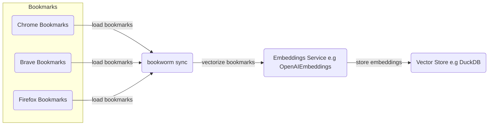
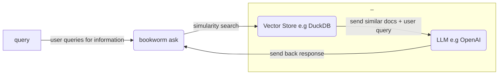

# bookworm 📖

[](https://github.com/kiran94/bookworm/actions/workflows/main.yml) [](https://badge.fury.io/py/bookworm_genai)

> LLM-powered bookmark search engine

`bookworm` allows you to search from your local browser bookmarks using natural language. For times when you have a large collection of bookmarks and you can't quite remember where you put that one website you need at the moment.

## Install

```bash
python -m pip install bookworm_genai
```

> [!TIP]
> If you are using [`uvx`](https://docs.astral.sh/uv/guides/tools/) then you can also just run this:
> ```bash
> uvx --from bookworm_genai bookworm --help
> ```

## Usage

```bash
export OPENAI_API_KEY=

# Run once and then anytime bookmarks across supported browsers changes
bookworm sync

# Sync bookmarks only from a specific browser
bookworm sync --browser-filter chrome

# Ask questions against the bookmark database
bookworm ask

# Ask questions against the bookmark database
# Specify the query when invoking the command
# If you omit this then you will be asked for a query when the tool is running
bookworm ask -q pandas

# Ask questions against the bookmark database and specify the number of results that should come back
bookworm ask -n 1
```

The `sync` process currently supports the following configurations:

| Operating System   | Google Chrome   | Mozilla Firefox   | Brave   | Microsoft Edge   |
| ------------------ | --------------- | ----------------- | ------- | ---------------- |
| **Linux**          | ✅              | ✅                | ✅      | ❌               |
| **macOS**          | ✅              | ✅                | ✅      | ❌               |
| **Windows**        | ❌              | ❌                | ❌      | ❌               |

> [!TIP]
> ✨ Want to contribute? See the [adding an integration](#adding-an-integration) section.

## Processes

*`bookworm sync`*

```python
python -m bookworm sync
```



<details>
<summary>Details</summary>

The vector database depicted above is stored locally on your machine. You can check it's location by running the following after installing this project:

```python
from platformdirs import PlatformDirs

print(PlatformDirs('bookworm').user_data_dir)
```

</details>

---

*`bookworm ask`*

```python
python -m bookworm ask
```



---

## Developer Setup

```bash
# LLMs
export OPENAI_API_KEY=

# Langchain (optional, but useful for debugging)
export LANGCHAIN_API_KEY=
export LANGCHAIN_TRACING_V2=true
export LANGCHAIN_PROJECT=bookworm

# Misc (optional)
export LOGGING_LEVEL=INFO
```

Recommendations:

- Install [`pyenv`](https://github.com/pyenv/pyenv?tab=readme-ov-file#installation) and ensure [build dependencies are installed](https://github.com/pyenv/pyenv?tab=readme-ov-file#install-python-build-dependencies) for your OS.
- Install [Poetry](https://python-poetry.org/docs/) we will be using [environment management](https://python-poetry.org/docs/managing-environments/) below.


```bash
poetry env use 3.9 # or path to your 3.9 installation

poetry shell
poetry install

bookworm --help
```

<details>
<summary>Running Linux tests on MacOS/Windows</summary>

If you are running on a non-linux machine, it may be helpful to run the provided [Dockerfile](./Dockerfile.linux) to verify it's working on that environment.

You can build this via:

```bash
make docker_linux
```

You will need to have Docker installed to run this.

</details>

## Adding an Integration

As you can see from [usage](#usage), bookworm supports various integrations but not all. If you find one that you want to support one, then a change is needed inside [integrations.py](./bookworm_genai/integrations.py).

You can see in that file there is a variable called `browsers` that follows this structure:

```python
browsers = {
    "BROWSER": {
        "PLATFORM": {
            ...
        }
    }
}
```

So say you wanted to add Chrome support in Windows then you would go under the Chrome key and then add a `win32` key which has all the details. You can refer to existing examples but generally the contents of those details are *where* to find the bookmarks on the user's system along with how to *interpret* them.

You can also find a full list of the document loaders supported [here](https://python.langchain.com/docs/integrations/document_loaders/).