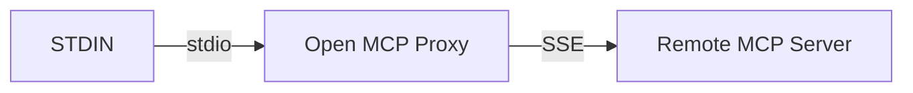
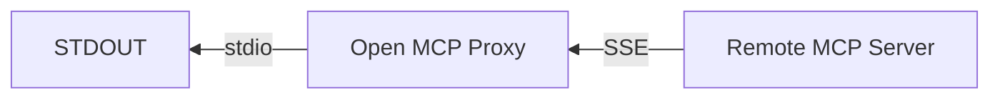
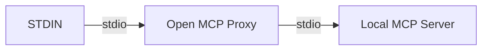
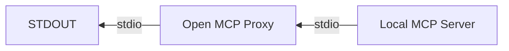

# Open MCP Proxy

A simple and lightweight open-source bidirectional proxy for MCP servers.

It exposes several callbacks that you can use to implement your own logic and do your own actions during the MCP protocol lifecycle.

It supports both SSE and STDIO protocols so it can be used to enable MCP Client supporting only stdio (like the Claude Desktop App) to also support SSE.

It leverages as much as possible the official mcp-python-sdk to remains simple, lightweight and future-proof.

it declines in 2 versions to support both SSE and STDIO protocols:

**SSE Proxy**





**STDIO Proxy**





Note that in both cases the proxy listen to STDIN and write to STDOUT to work seemlessly with stdio MCP Clients.

## Usage

### Hook into the MCP protocol lifecycle

The recommended approach to hook into the MCP protocol lifecycle is to subclass one of the Proxy class that we expose and override the callback methods you need.

At the moment, we expose 4 callback methods:

| Method | Description | Parameters |
|--------|-------------|------------|
| `_on_mcp_client_message` | Can be used to handle messages from the MCP client | `message: JSONRPCMessage` |
| `_on_mcp_server_message` | Can be used to handle messages from the MCP server | `message: JSONRPCMessage \| Exception` |
| `_on_start` | Can be used to handle the start of the proxy | None |
| `_on_close` | Can be used to handle the close of the proxy | None |

For example if you need a proxy over the stdio protocol:

```python
from omproxy.proxy import StdioProxy

class MyStdioProxy(StdioProxy):
    def _on_start(self):
        print("Starting proxy", file=sys.stderr)

    def _on_mcp_client_message(self, message: JSONRPCMessage):
        print(message, file=sys.stderr)

    def _on_mcp_server_message(self, message: JSONRPCMessage | Exception):
        print(message, file=sys.stderr)

    def _on_close(self):
        print("Closing proxy", file=sys.stderr)

if __name__ == "__main__":
    proxy = MyStdioProxy()
    proxy.run(StdioServerParameters(command="uv", args=["run", "src/example_server.py"]))
```

**tip**: dont write to stdout in your callbacks or anywhere really as it will mess with the stdio MCP communication.

### MCP Client supporting only STDIO to your SSE MCP Server

We provide a simple CLI to start the proxy if you have an SSE MCP server running and you want to make it available to an MCP Client supporting only stdio you can simply do:

```bash
uvx omproxy@latest sse --url https://yourssemcpserver.io
```

see `uvx omproxy@latest sse --help` for more information including setting headers for authorization for example.
