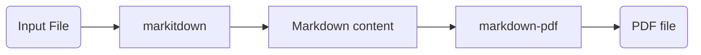

<div align="center">
<h1>PdfItDown</h1>
<h2>Convert Everything to PDF</h2>
</div>
<br>
<div align="center">
    
</div>

**PdfItDown** is a python package that relies on [`markitdown` by Microsoft](https://github.com/microsoft/markitdown/) and [`markdown_pdf`](https://github.com/vb64/markdown-pdf). 

### Applicability

**PdfItDown** is applicable to the following file formats:

- PDF
- PowerPoint
- Word
- Excel
- HTML
- Text-based formats (CSV, JSON, XML)
- ZIP files (iterates over contents)

### How does it work?

**PdfItDown** works in a very simple way:



### Installation and Usage

To install **PdfItDown**, just run:

```bash
python3 -m pip install pdfitdown
```

And then you can simply use it inside your python scripts:

```python
from pdfitdown.pdfconversion import convert_to_pdf

output_pdf = convert_to_pdf(file_path = "BusinessGrowth.xlsx", output_path = "business_growth.pdf", title = "Business Growth")
```

In this example, you will find the output PDF under `business_growth.pdf`.

### Contributing

Contributions are always welcome!

Find contribution guidelines at [CONTRIBUTING.md](https://github.com/AstraBert/PdfItDown/tree/main/CONTRIBUTING.md)

### License and Funding

This project is open-source and is provided under an [MIT License](https://github.com/AstraBert/PdfItDown/tree/main/LICENSE).

If you found it useful, please consider [funding it](https://github.com/sponsors/AstraBert).